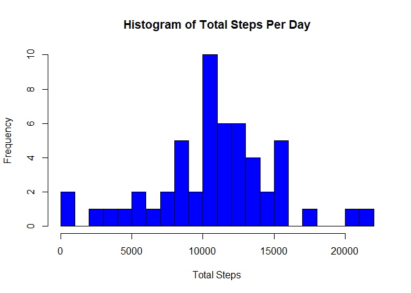
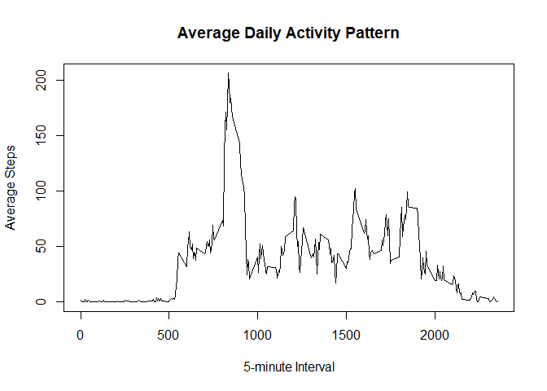
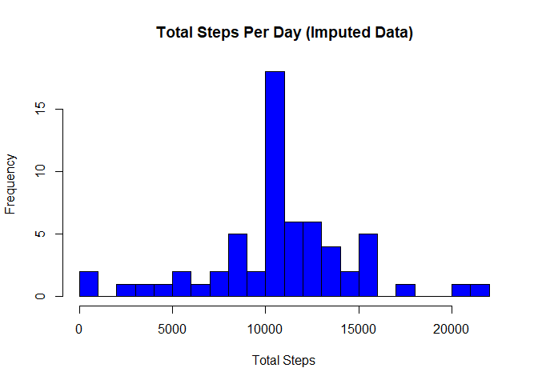
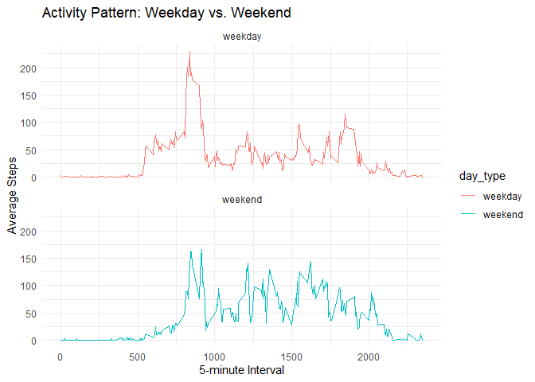

## Loading and preprocessing the data

``` r
# Load required libraries
library(dplyr)
```

```
## Warning: package 'dplyr' was built under R version 4.4.3
```

```
## 
## Attaching package: 'dplyr'
```

```
## The following objects are masked from 'package:stats':
## 
##     filter, lag
```

```
## The following objects are masked from 'package:base':
## 
##     intersect, setdiff, setequal, union
```

``` r
# Load the dataset
activity <- read.csv("activity.csv", stringsAsFactors = FALSE)

# Convert date column to Date type
activity$date <- as.Date(activity$date, format="%Y-%m-%d")
```


## What is mean total number of steps taken per day?

``` r
# Remove NA values and summarize total steps per day
total_steps_per_day <- activity %>% 
  filter(!is.na(steps)) %>% 
  group_by(date) %>% 
  summarize(total_steps = sum(steps))
```
<!-- -->

``` r
# Calculate mean and median
mean_steps <- mean(total_steps_per_day$total_steps)
median_steps <- median(total_steps_per_day$total_steps)

# Print results
cat("Mean Total Steps Per Day:", mean_steps, "\n")
```

```
## Mean Total Steps Per Day: 10766.19
```

``` r
cat("Median Total Steps Per Day:", median_steps, "\n")
```

```
## Median Total Steps Per Day: 10765
```

## What is the average daily activity pattern?


``` r
avg_steps_interval <- activity %>%
  group_by(interval) %>%
  summarize(avg_steps = mean(steps, na.rm = TRUE))

plot(avg_steps_interval$interval, avg_steps_interval$avg_steps, type = "l",
     xlab = "5-minute Interval", ylab = "Average Steps",
     main = "Average Daily Activity Pattern")
```

<!-- -->

### Interval with Maximum Steps

``` r
max_interval <- avg_steps_interval[which.max(avg_steps_interval$avg_steps), ]
max_interval
```

```
## # A tibble: 1 × 2
##   interval avg_steps
##      <int>     <dbl>
## 1      835      206.
```

## Imputing missing values

``` r
total_missing <- sum(is.na(activity$steps))
total_missing
```

```
## [1] 2304
```

### Filling Missing Values

``` r
filled_activity <- activity
avg_steps_per_interval <- activity %>%
  group_by(interval) %>%
  summarize(mean_steps = mean(steps, na.rm = TRUE))

for (i in 1:nrow(filled_activity)) {
  if (is.na(filled_activity$steps[i])) {
    filled_activity$steps[i] <- avg_steps_per_interval$mean_steps[avg_steps_per_interval$interval == filled_activity$interval[i]]
  }
}
```

## Histogram of Total Steps Per Day (After Imputation)


``` r
total_steps_per_day_filled <- filled_activity %>%
  group_by(date) %>%
  summarize(total_steps = sum(steps))

hist(total_steps_per_day_filled$total_steps, 
     main = "Total Steps Per Day (Imputed Data)", 
     xlab = "Total Steps", col = "blue", 
     breaks = 20)
```

<!-- -->

### Mean and Median After Imputation

``` r
mean_steps_filled <- mean(total_steps_per_day_filled$total_steps)
median_steps_filled <- median(total_steps_per_day_filled$total_steps)
mean_steps_filled
```

```
## [1] 10766.19
```

``` r
median_steps_filled
```

```
## [1] 10766.19
```

## Are there differences in activity patterns between weekdays and weekends?

``` r
filled_activity$day_type <- ifelse(weekdays(filled_activity$date) %in% c("Saturday", "Sunday"), "weekend", "weekday")
```

### Panel Plot for Weekday vs. Weekend

``` r
library(ggplot2)
```

```
## Warning: package 'ggplot2' was built under R version 4.4.3
```

``` r
avg_steps_by_day_type <- filled_activity %>%
  group_by(interval, day_type) %>%
  summarize(avg_steps = mean(steps))
```

```
## `summarise()` has grouped output by 'interval'. You can override using the
## `.groups` argument.
```

``` r
ggplot(avg_steps_by_day_type, aes(x = interval, y = avg_steps, color = day_type)) +
  geom_line() +
  facet_wrap(~day_type, ncol = 1) +
  labs(title = "Activity Pattern: Weekday vs. Weekend", x = "5-minute Interval", y = "Average Steps") +
  theme_minimal()
```

<!-- -->
